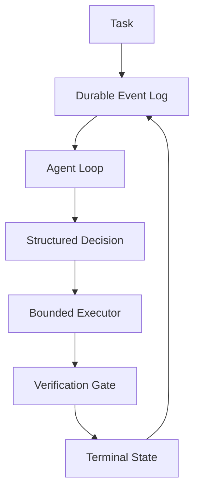

<p align="center">
  <h1 align="center">Rust Agent Runtime</h1>
  <p align="center">
    Durable, bounded execution for coding-agent experiments — model decisions separated
    from tool authority.
  </p>
</p>

<p align="center">
  <a href="https://github.com/rustfuture/rust-agent-runtime/actions/workflows/ci.yml"></a>
  
  <a href="LICENSE"></a>
</p>

<p align="center">
  <a href="#capabilities">Capabilities</a> ·
  <a href="#architecture">Architecture</a> ·
  <a href="#quick-start">Quick Start</a> ·
  <a href="#evaluation-evidence">Evidence</a> ·
  <a href="#durability">Durability</a> ·
  <a href="#security-boundaries">Security</a>
</p>

A durable, bounded Rust runtime for experimenting with coding-agent workflows. A provider
can request a structured action, but file access and subprocess execution remain subject to
limits enforced by the runtime. This is a research prototype, **not** a general-purpose
security sandbox.

## Capabilities

| Durable State | Bounded Execution | Verification Debt | Provider Boundary |
|---|---|---|---|
| Append-only event replay | Timeouts, output caps, process-group termination | Explicit `verify` action; edits create debt | Schema-constrained AGY actions |

- Append-only task state with idempotent enqueue, explicit retry, cancellation, and restart recovery.
- Allowlisted subprocess execution with workspace containment and Unix process-group termination.
- Structured provider decisions, streamed text events, usage metadata, and a step-bounded agent loop.
- Exact-match file edits followed by an operator-defined verification command the model cannot
  replace or extend.
- Independent acceptance fixtures kept outside the model-visible workspace.
- An opt-in macOS Seatbelt backend that denies network access and writes outside the workspace.

## Architecture



The runtime reconstructs state by replaying the event log. It records `running` before a model
call or tool execution and persists metadata-only traces for completed commands. On restart, a
matching completed trace is reconciled instead of repeating the command; an interrupted run
without a completed trace is requeued with its attempt count preserved.

`AGENT_VERIFY` is parsed once by the operator-facing CLI. After an edit, only the explicit
`verify` action runs that exact command and clears verification debt. A successful arbitrary
tool call cannot substitute for verification.

## Quick Start

Rust 1.85 or newer is required.

```bash
cargo build --locked
cargo test --locked
```

Exercise durable task state without a model:

```bash
cargo run --locked -- enqueue ./runtime-data demo-task
cargo run --locked -- status ./runtime-data
cargo run --locked -- watch ./runtime-data 500
```

The `run` command connects a queued task to the bounded agent loop:

```bash
AGENT_TASK="make the failing test pass" \
AGENT_ALLOWED="cargo" \
AGENT_VERIFY="cargo test" \
AGY_BIN=/path/to/agy \
cargo run --locked -- run ./runtime-data demo-task ./fixture
```

The terminal interface provides `enqueue`, `run`, `cancel`, `status`, and `watch`. Status views
use a read-only replay path and do not trigger recovery as a side effect of observation.

## Provider Boundary

The included AGY adapter requests schema-constrained actions and runs the provider process with a
local wall-clock timeout, captured-output limit, cancellation propagation, and its own process
group. Model-requested tools return to the Rust executor and still pass through the program
allowlist and workspace checks.

Real provider calls are opt-in and are not part of normal CI:

```bash
provider_dir=$(mktemp -d)
AGY_BIN=/path/to/agy AGY_WORK_DIR="$provider_dir" \
  cargo run --locked --example agy_smoke
```

`AgyProvider::stream_text` consumes AGY's newline-delimited event stream while retaining final
token and latency metadata; see `examples/agy_stream_smoke.rs`.

## Evaluation Evidence

The evaluation uses three defect families — `off_by_one`, `clamp_range`, `prefix_format`. The model
can inspect and edit only the fixture source; an independent acceptance crate is assembled after
the run.

- Primary real-model run: 3/3 independent acceptance passes and 3/3 clean worker completions.
- Confirmation run: 3/3 acceptance passes and 2/3 clean worker completions; the remaining worker
  received provider HTTP 503 responses after producing and verifying the accepted patch.
- Aggregate: 6/6 accepted patches and 5/6 clean worker completions across the two recorded runs.
- Deterministic controls: 36 checks covering invalid baselines, acceptance failures, timeouts,
  step limits, mixed families, reruns, and successful completion.

These are small fixture measurements, not a generalized autonomy score. Full commands, per-family
results, latency, tokens, patches, and failure analysis are in
[`evaluation/fresh-evaluation-report.md`](evaluation/fresh-evaluation-report.md). The earlier
[`evaluation/fixture-evaluation-report.md`](evaluation/fixture-evaluation-report.md) is retained as
a historical pre-hardening result.

## Durability

- State is an append-only event log; enqueue is idempotent and retries are recorded as distinct
  attempts.
- Completed commands are reconciled from metadata-only traces on restart instead of being repeated.
- Argument values and captured output are deliberately excluded from durable traces to reduce
  secret retention.
- **External side effects are not exactly-once.** A crash after a side effect but before its trace
  is synced cannot be made whole by this local log; tools that mutate remote systems need their own
  idempotency key or transaction boundary.
- Timeout and cancellation terminate the child process group but cannot undo side effects that
  already occurred.

See [`docs/architecture.md`](docs/architecture.md) for component and trust boundaries.

## Security Boundaries

- The default executor is **not** an OS sandbox. An allowlisted program can exercise any capability
  the host grants it unless an isolation backend removes that capability.
- Workspace containment restricts paths accepted by runtime file operations; it does not hide
  environment variables or constrain CPU and memory.
- The macOS Seatbelt backend is opt-in. No equivalent Linux isolation backend is claimed.
- Automatic merge, unrestricted shell execution, and network isolation on every platform are out of
  scope for this release.
- Allowed programs and arguments must be treated as capabilities.

Report sensitive issues according to [`SECURITY.md`](SECURITY.md).

## Development

```bash
cargo fmt --check
cargo check --locked --all-targets
cargo clippy --locked --all-targets -- -D warnings
cargo test --locked
bash evaluation/run_controls.sh
```

CI runs the Rust checks on stable, checks the MSRV (1.85.0), and executes the deterministic
evaluation controls without contacting a model. Contribution expectations are in
[`CONTRIBUTING.md`](CONTRIBUTING.md).

## Repository Map

| Path | Contents |
|---|---|
| `src/lib.rs`, `src/worker.rs` | Event-sourced task state, recovery, worker loop |
| `src/agent.rs` | Step-bounded agent loop and verification debt |
| `src/executor.rs` | Bounded subprocess execution and process groups |
| `src/provider.rs` | AGY adapter, timeouts, output caps, stream parsing |
| `src/workspace.rs` | Workspace containment and exact-match edits |
| `src/main.rs` | Terminal interface (`enqueue`, `run`, `cancel`, `status`, `watch`) |
| `evaluation/` | Fixtures, reports, and deterministic controls |
| `examples/` | AGY adapter smoke examples |

## License

MIT — see [LICENSE](LICENSE).
