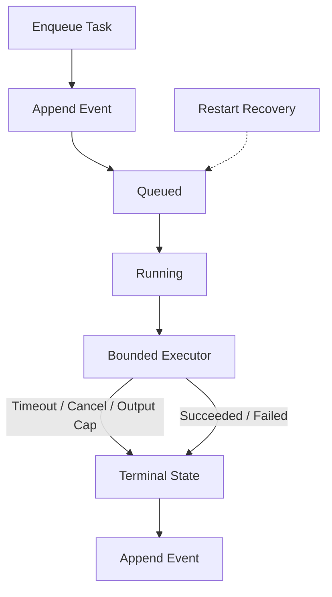

# Rust Agent Runtime


[](https://github.com/rustfuture/rust-agent-runtime/actions/workflows/ci.yml)

A durable, bounded Rust runtime for experimenting with coding-agent workflows.

The project separates model decisions from tool authority. A provider can request a structured
action, but file access and subprocess execution remain subject to limits enforced by the runtime.
It is a research prototype, not a general-purpose security sandbox.

## What it demonstrates

- Append-only task state with idempotent enqueue, explicit retry, cancellation, and restart recovery.
- Allowlisted subprocess execution with workspace containment, timeouts, bounded output, and Unix
  process-group termination.
- Structured provider decisions, streamed text events, usage metadata, and a step-bounded agent loop.
- Exact-match file edits followed by an operator-defined verification command that the model cannot
  replace or extend.
- Independent evaluation fixtures that keep acceptance tests outside the model-visible workspace.
- An opt-in macOS Seatbelt backend that denies network access and writes outside the workspace.

## Quick start

Rust 1.85 or newer is required.

```bash
cargo build --locked
cargo test --locked
```

Exercise the durable task state without a model:

```bash
cargo run --locked -- enqueue ./runtime-data demo-task
cargo run --locked -- status ./runtime-data
cargo run --locked -- watch ./runtime-data 500
```

The `run` command connects a queued task to the bounded agent loop:

```bash
AGENT_TASK="make the failing test pass" \
AGENT_ALLOWED="cargo" \
AGENT_VERIFY="cargo test" \
AGY_BIN=/path/to/agy \
cargo run --locked -- run ./runtime-data demo-task ./fixture
```

`AGENT_VERIFY` is parsed once by the operator-facing CLI. After an edit, only the explicit `verify`
action runs that exact command and clears verification debt. A successful arbitrary tool call cannot
substitute for verification.

## Provider boundary

The included AGY adapter requests schema-constrained actions from `gemini-3.8-flash-low`. It runs the
provider process with a local wall-clock timeout, captured-output limit, cancellation propagation,
and its own process group. Model-requested tools return to the Rust executor and still pass through
the program allowlist and workspace checks.

Real provider calls are opt-in and are not part of normal CI:

```bash
provider_dir=$(mktemp -d)
AGY_BIN=/path/to/agy AGY_WORK_DIR="$provider_dir" \
  cargo run --locked --example agy_smoke
```

`AgyProvider::stream_text` also consumes AGY's newline-delimited event stream while retaining the
final token and latency metadata. See `examples/agy_stream_smoke.rs` for the minimal adapter example.

## Evaluation evidence

The current evaluation uses three defect families: `off_by_one`, `clamp_range`, and
`prefix_format`. The model can inspect and edit only the fixture source; an independent acceptance
crate is assembled after the run.

- Primary real-model run: 3/3 independent acceptance passes and 3/3 clean worker completions.
- Confirmation run: 3/3 acceptance passes and 2/3 clean worker completions. The remaining worker
  received provider HTTP 503 responses after producing and verifying the accepted patch.
- Aggregate: 6/6 accepted patches and 5/6 clean worker completions across the two recorded runs.
- Deterministic CI controls: 36 checks covering invalid baselines, acceptance failures, timeouts,
  step limits, mixed families, reruns, and successful completion.

These are small fixture measurements, not a generalized autonomy score. Full commands, per-family
results, latency, tokens, patches, and failure analysis are in
[`evaluation/fresh-evaluation-report.md`](evaluation/fresh-evaluation-report.md). The earlier
[`evaluation/fixture-evaluation-report.md`](evaluation/fixture-evaluation-report.md) is retained as a
historical pre-hardening result rather than presented as the current score.

## Architecture and durability



The runtime reconstructs state by replaying an append-only event log. It records `running` before a
model call or tool execution and persists metadata-only traces for completed commands. On restart, a
matching completed trace is reconciled instead of repeating the command; an interrupted run without
a completed trace is requeued with its attempt count preserved.

Argument values and captured output are deliberately excluded from durable traces to reduce secret
retention. This does not create exactly-once semantics for external side effects: tools that mutate
remote systems still need their own idempotency key or transaction boundary.

The terminal interface provides enqueue, run, cancel, status, and watch commands. Status views use a
read-only replay path and do not trigger recovery as a side effect of observation.

See [`docs/architecture.md`](docs/architecture.md) for component and trust boundaries.

## Engineering Value / Portfolio Showcase

This project demonstrates several advanced engineering practices suitable for a FAANG-level environment:

- **Durable Execution State:** Implements an event-sourced architecture for append-only task state, ensuring idempotency, crash recovery, and durable state transitions for execution boundaries (Note: external side effects are NOT exactly-once).
- **Strict Isolation & Security:** Utilizes a bounded executor with Unix process-group termination, strict workspace containment, and an opt-in macOS Seatbelt profile to prevent unauthorized side effects.
- **Robust System Programming:** Showcases safe systems programming in Rust, handling complex OS-level interactions (pipes, process groups, timeouts) and deterministic testing.


## Security boundaries

- The default executor is not an OS sandbox. An allowlisted program can exercise any capability the
  host grants it unless an isolation backend removes that capability.
- Workspace containment restricts paths accepted by runtime file operations; it does not hide
  environment variables or constrain CPU and memory.
- Timeout and cancellation terminate the child process group but cannot undo earlier side effects.
- The macOS Seatbelt backend is opt-in. No equivalent Linux isolation backend is claimed.
- Automatic merge, unrestricted shell execution, and network isolation on every platform are out of
  scope for this release.

Report sensitive issues according to [`SECURITY.md`](SECURITY.md).

## Development

```bash
cargo fmt --check
cargo check --locked --all-targets
cargo clippy --locked --all-targets -- -D warnings
cargo test --locked
bash evaluation/run_controls.sh
```

CI runs the Rust checks on stable, checks the MSRV, and executes the deterministic evaluation
controls without contacting a model. Contribution expectations are in
[`CONTRIBUTING.md`](CONTRIBUTING.md).

Licensed under the MIT License.
