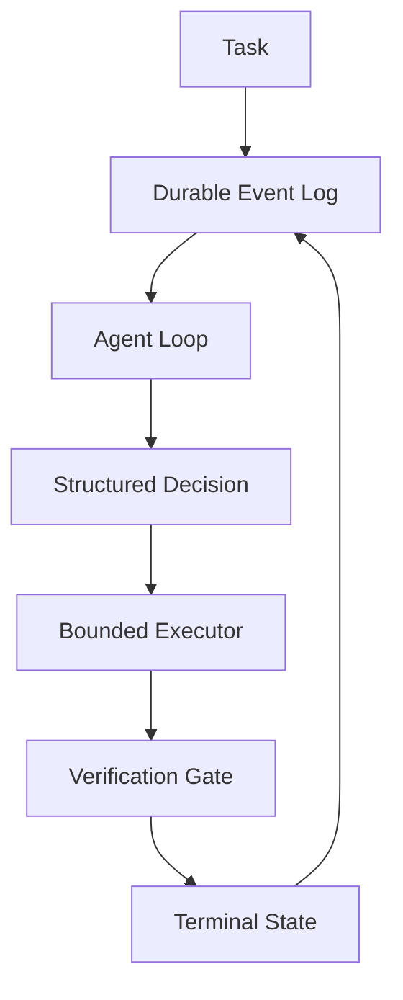

# Rust Agent Runtime

A bounded task runtime and evaluation harness for autonomous coding-agent experiments, separating model decisions from execution authority.

[](https://github.com/rustfuture/rust-agent-runtime/actions/workflows/ci.yml)
[](LICENSE)

**Status:** Research prototype (pre-1.0; bounded subprocess execution, append-only task recovery, and deterministic evaluation controls; not a general-purpose security sandbox).

- **Durable task lifecycle:** Reconstructs task state via an append-only event log with idempotent enqueue, retry bounds, cancellation, and restart recovery.
- **Bounded subprocess execution:** Runs allowlisted programs in a canonical workspace directory with wall-clock timeouts, captured output byte caps, and Unix process-group termination.
- **Separated model authority:** Constrains model providers (such as AGY, the Google Antigravity command-line client used here to call Gemini models) to structured actions and streamed text events while enforcing tool execution through the runtime.
- **Verification debt:** Enforces that file edits require passing an operator-configured verification command before a task can complete.
- **Independent acceptance evaluation:** Validates agent patches against external acceptance fixtures isolated from the agent's workspace.

---

[Quick Start](#quick-start) · [Architecture](#architecture) · [Evaluation Evidence](#evaluation-evidence) · [Durability](#durability) · [Scope and Limitations](#scope-and-limitations) · [License](#license)

## Quick Start

Rust 1.85 or newer is required.

### Build and test

```bash
cargo build --locked
cargo test --locked
```

### Exercise task lifecycle (offline)

The CLI manages durable tasks without requiring an external model:

```bash
# Enqueue a demo task
cargo run --locked -- enqueue ./runtime-data demo-task

# Check task status (replays event log read-only)
cargo run --locked -- status ./runtime-data

# Cancel the task
cargo run --locked -- cancel ./runtime-data demo-task
```

### Run with a model provider

When an AGY provider binary is configured, connect a queued task to the bounded agent loop:

```bash
AGENT_TASK="make the failing test pass" \
AGENT_ALLOWED="cargo" \
AGENT_VERIFY="cargo test" \
AGY_BIN=/path/to/agy \
cargo run --locked -- run ./runtime-data demo-task ./fixture
```

The terminal interface provides `enqueue`, `run`, `cancel`, `status`, and `watch`. Status views use a read-only replay path and do not trigger recovery as a side effect of observation.

## Architecture


```mermaid
flowchart TD
    T[Task] --> L[Durable Event Log]
    L --> A[Agent Loop]
    A --> D[Structured Decision]
    D --> X[Bounded Executor]
    X --> V[Verification Gate]
    V --> S[Terminal State]
    S --> L
```

The runtime reconstructs state by replaying the event log. It records `running` before a model call or tool execution and persists metadata-only traces for completed commands. On restart, a matching completed trace is reconciled instead of repeating the command; an interrupted run without a completed trace is requeued with its attempt count preserved.

`AGENT_VERIFY` is parsed once by the operator-facing CLI. After an edit, only the explicit `verify` action runs that exact command and clears verification debt. A successful arbitrary tool call cannot substitute for verification.

Detailed component design, process supervision, and trust boundaries are documented in [`docs/architecture.md`](docs/architecture.md).

## Provider Boundary

The included AGY adapter requests schema-constrained actions and runs the provider process with a local wall-clock timeout, captured-output limit, cancellation propagation, and its own process group. Model-requested tools return to the Rust executor and still pass through the program allowlist and workspace checks.

Real provider calls are opt-in and are not part of normal CI:

```bash
provider_dir=$(mktemp -d)
AGY_BIN=/path/to/agy AGY_WORK_DIR="$provider_dir" \
  cargo run --locked --example agy_smoke
```

`AgyProvider::stream_text` consumes AGY's newline-delimited event stream while retaining final token and latency metadata; see [`examples/agy_stream_smoke.rs`](examples/agy_stream_smoke.rs).

## Evaluation Evidence

The evaluation tests three defect families — `off_by_one`, `clamp_range`, and `prefix_format`. The model can inspect and edit only the fixture source; an independent acceptance crate is assembled after the run.

- **Primary real-model run:** 3/3 independent acceptance passes and 3/3 clean worker completions ([`evaluation/runs/20260910T215500Z-real/`](evaluation/runs/20260910T215500Z-real/)).
- **Confirmation run:** 3/3 acceptance passes and 2/3 clean worker completions ([`evaluation/runs/20260910T215600Z-real2/`](evaluation/runs/20260910T215600Z-real2/)); the remaining worker received provider HTTP 503 responses after producing and verifying the accepted patch.
- **Aggregate across real runs:** 6/6 accepted patches and 5/6 clean worker completions across the two recorded runs ([`evaluation/fresh-evaluation-report.md`](evaluation/fresh-evaluation-report.md)).
- **Deterministic controls:** 36 checks covering invalid baselines, acceptance failures, timeouts, step limits, mixed families, reruns, and successful completion ([`evaluation/controls/results.log`](evaluation/controls/results.log)).

These are small fixture measurements, not a generalized autonomy score. Full commands, per-family results, latency, tokens, patches, and failure analysis are documented in [`evaluation/fresh-evaluation-report.md`](evaluation/fresh-evaluation-report.md). The earlier [`evaluation/fixture-evaluation-report.md`](evaluation/fixture-evaluation-report.md) is retained as historical pre-hardening evidence.

## Durability

- State is an append-only event log; enqueue is idempotent and retries are recorded as distinct attempts.
- Completed commands are reconciled from metadata-only traces on restart instead of being repeated.
- Argument values and captured output are deliberately excluded from durable traces to reduce secret retention.
- **External side effects are not exactly-once.** A crash after a side effect but before its trace is synced cannot be made whole by this local log; tools that mutate remote systems need their own idempotency key or transaction boundary.
- Timeout and cancellation terminate the child process group but cannot undo side effects that already occurred.

See [`docs/architecture.md`](docs/architecture.md) for durability and reconciliation specifics.

## Scope and Limitations

- **Not an OS sandbox by default:** The default executor relies on command allowlisting, path containment, output limits, and process-group termination. Allowed programs run with host user privileges unless an external isolation backend is configured.
- **Platform-dependent isolation:** The opt-in Seatbelt profile (`/usr/bin/sandbox-exec`) is available only on macOS. No Linux namespace or cgroup isolation backend is provided.
- **Non-atomic external side effects:** While internal task transitions and completed command metadata are durably logged, mutations to external systems (such as network APIs or remote repositories) cannot be rolled back upon crash or cancellation without external transaction management.
- **Side effects prior to termination:** Process-group termination (`SIGKILL`) on timeout or cancellation halts the active process group, but cannot revert filesystem changes or child process side effects that occurred before termination.
- **Synthetic evaluation suite:** The evaluation covers three synthetic defect families (`off_by_one`, `clamp_range`, `prefix_format`); it validates runtime mechanics rather than broad agent capability or general programming tasks.
- **Provider scope:** The included provider adapter targets AGY / Gemini CLI; direct SDK clients for OpenAI/Anthropic APIs, automated PR merge flows, and multi-agent swarms are out of scope.

Report sensitive security issues according to [`SECURITY.md`](SECURITY.md).

## Development

Run the CI checks locally:

```bash
cargo fmt --check
cargo check --locked --all-targets
cargo clippy --locked --all-targets -- -D warnings
cargo test --locked
bash evaluation/run_controls.sh
```

CI runs the Rust checks on stable, verifies the MSRV (1.85.0), and executes the deterministic evaluation controls without contacting an external model. Contribution guidelines are in [`CONTRIBUTING.md`](CONTRIBUTING.md).

## Repository Map

| Path | Contents |
|---|---|
| `src/lib.rs`, `src/worker.rs` | Event-sourced task state, recovery, worker loop |
| `src/agent.rs` | Step-bounded agent loop and verification debt |
| `src/executor.rs` | Bounded subprocess execution and process groups |
| `src/provider.rs` | AGY adapter, timeouts, output caps, stream parsing |
| `src/workspace.rs` | Workspace containment and exact-match edits |
| `src/main.rs` | Terminal interface (`enqueue`, `run`, `cancel`, `status`, `watch`) |
| `evaluation/` | Fixtures, reports, and deterministic controls |
| `examples/` | AGY adapter smoke examples |

## License

MIT — see [LICENSE](LICENSE).

