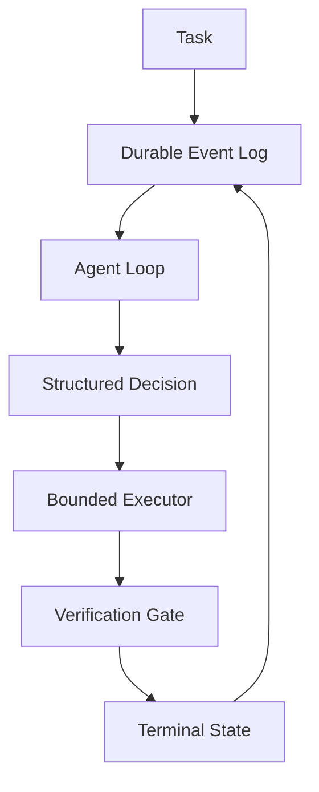

# Rust Agent Runtime

Rust Agent Runtime executes automated coding tasks using language models while enforcing execution timeouts, command restrictions, and verification tests.

[](https://github.com/rustfuture/rust-agent-runtime/actions/workflows/ci.yml)
[](LICENSE)

**Status:** Research prototype (pre-1.0; bounded execution; not a general security sandbox).

- Reconstructs task state from an append-only event log with restart recovery.
- Runs allowlisted commands with timeouts, output caps, and process-group termination.
- Routes model actions through the runtime rather than letting models execute directly.
- Requires passing a verification test command after any workspace file edit.
- Validates patches against external acceptance tests isolated from the workspace.

## Quick start

Rust 1.85 or newer is required.

### Build and test

```bash
cargo build --locked
cargo test --locked
```

### Exercise task lifecycle (offline)

The CLI manages durable tasks without an external model:

```bash
# Enqueue a demo task
cargo run --locked -- enqueue ./runtime-data demo-task

# Check task status (replays event log read-only)
cargo run --locked -- status ./runtime-data

# Cancel the task
cargo run --locked -- cancel ./runtime-data demo-task
```

### Run with a model provider

When an AGY provider binary is configured (Google Antigravity command-line client, used to call Gemini models), connect a queued task to the agent loop:

```bash
AGENT_TASK="make the failing test pass" \
AGENT_ALLOWED="cargo" \
AGENT_VERIFY="cargo test" \
AGY_BIN=/path/to/agy \
cargo run --locked -- run ./runtime-data demo-task ./fixture
```

The terminal interface supports `enqueue`, `run`, `cancel`, `status`, and `watch`. Status views replay the event log read-only without triggering recovery side effects.

## Architecture


```mermaid
flowchart TD
    T[Task] --> L[Durable Event Log]
    L --> A[Agent Loop]
    A --> D[Structured Decision]
    D --> X[Bounded Executor]
    X --> V[Verification Gate]
    V --> S[Terminal State]
    S --> L
```

- The operator enqueues a task, which the runtime logs in an append-only event file.
- The worker marks the task running and requests structured decisions from the model provider.
- The executor runs allowlisted commands inside the workspace with timeouts and output limits.
- Any workspace edit incurs verification debt, requiring the configured verification command to pass.
- The worker records execution traces and final status to the log; details are in [`docs/architecture.md`](docs/architecture.md).

## Provider Boundary

The AGY adapter runs provider processes under wall-clock timeouts, output limits, and process-group supervision. Model-requested tools return to the runtime executor to pass allowlist and workspace checks. Real provider calls are opt-in and omitted from CI; see [`docs/reference.md`](docs/reference.md) for smoke test commands and event streaming.

`AgyProvider::stream_text` consumes AGY's newline-delimited event stream and keeps the final token and latency metadata; see [`examples/agy_stream_smoke.rs`](examples/agy_stream_smoke.rs).

## Evaluation Evidence

The evaluation tests three defect families — `off_by_one`, `clamp_range`, and `prefix_format`. The model can inspect and edit only the fixture source; an independent acceptance crate is assembled after the run.

- **Primary real-model run:** 3/3 independent acceptance passes and 3/3 clean worker completions ([`evaluation/runs/20260910T215500Z-real/`](evaluation/runs/20260910T215500Z-real/)).
- **Confirmation run:** 3/3 acceptance passes and 2/3 clean worker completions ([`evaluation/runs/20260910T215600Z-real2/`](evaluation/runs/20260910T215600Z-real2/)); the remaining worker received provider HTTP 503 responses after producing and verifying the accepted patch.
- **Aggregate across real runs:** 6/6 accepted patches and 5/6 clean worker completions across the two recorded runs ([`evaluation/fresh-evaluation-report.md`](evaluation/fresh-evaluation-report.md)).
- **Deterministic controls:** 36 checks covering invalid baselines, acceptance failures, timeouts, step limits, mixed families, reruns, and successful completion ([`evaluation/controls/results.log`](evaluation/controls/results.log)).

These are small fixture measurements, not a generalized autonomy score. Full commands, per-family results, latency, tokens, patches, and failure analysis are documented in [`evaluation/fresh-evaluation-report.md`](evaluation/fresh-evaluation-report.md). The earlier [`evaluation/fixture-evaluation-report.md`](evaluation/fixture-evaluation-report.md) is retained as historical pre-hardening evidence.

## Durability

- State is stored in an append-only event log with idempotent enqueue and retry tracking.
- Completed commands reconcile from metadata-only traces on restart rather than repeating execution.
- Command arguments and outputs are excluded from traces to prevent secret retention.
- External side effects are not exactly-once; external systems require their own idempotency keys.
- Process-group termination halts running processes on timeout or cancellation, but cannot revert earlier side effects.

Details on state recovery and reconciliation are documented in [`docs/architecture.md`](docs/architecture.md).

## Scope and Limitations

- The default executor relies on command allowlists, path containment, output limits, and process-group termination rather than an OS sandbox.
- The optional Seatbelt profile (`/usr/bin/sandbox-exec`) is available only on macOS.
- Mutations to external systems (such as network APIs or remote repositories) cannot be rolled back on crash or cancellation.
- Process-group termination halts running processes on timeout or cancellation, but does not revert earlier filesystem changes.
- The evaluation suite covers three synthetic defect families to test runtime mechanics rather than broad programming autonomy.
- The included provider adapter targets AGY / Gemini CLI; direct SDK clients and multi-agent swarms are out of scope.

Report security issues according to [`SECURITY.md`](SECURITY.md).

## Tests

```bash
cargo test --locked
```

The test suite covers task lifecycle transitions, bounded subprocess execution, workspace containment, and model provider schema integration.

Contribution guidelines are in [`CONTRIBUTING.md`](CONTRIBUTING.md).

## License

MIT — see [LICENSE](LICENSE).
